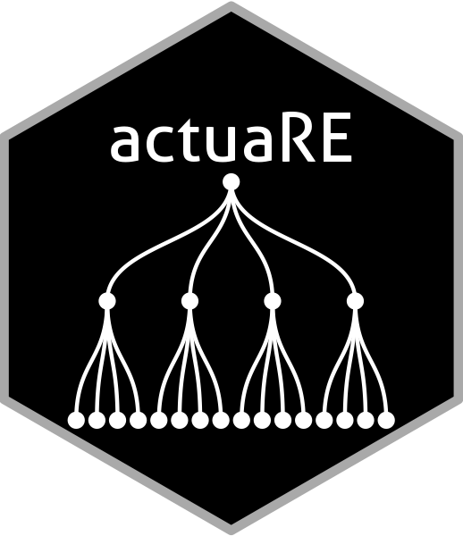

actuaRE: Handling hierarchically structured risk factors using random effects models. 
<br clear="right">
====

## Installation

### On current R (>= 3.0.0)
* Development version from Github:
```
library("devtools"); install_github("BavoDC/actuaRE", dependencies = TRUE, build_vignettes = TRUE)
```
(This requires `devtools` >= 1.6.1, and installs the "master" (development) branch.)
This approach builds the package from source, i.e. `make` and compilers must be installed on your system -- see the R FAQ for your operating system; you may also need to install dependencies manually. Specify `build_vignettes=FALSE` if you have trouble because your system is missing some of the `LaTeX/texi2dvi` tools.

## Documentation
The basic functionality of the package is explained and demonstrated in the vignette, which you can access using
```
vignette("actuaRE")
```
or via the [homepage](https://bavodc.github.io/websiteactuaRE/articles/actuaRE.html) of the package.
