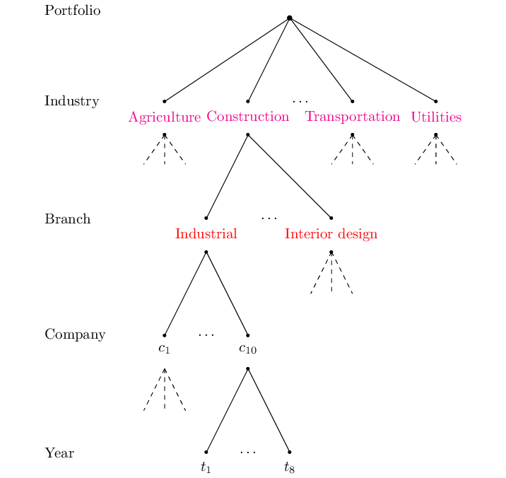

```{r setup, include = FALSE}
knitr::opts_chunk$set(
  collapse = TRUE,
  comment = "#>"
)
options(rmarkdown.html_vignette.check_title = FALSE)
```

<div>
```{r logo, echo=FALSE, out.width="25%"}

```
</div>
<br clear="right">
In this document, we give you a brief overview of the basic functionality of the `actuaRE` package. For a more detailed overview of the functions, you can consult the help-pages. Please feel free to send any suggestions and bug reports to the package author.


# Handling multi-level factors using random effects models
Multi-level factors (MLFs) are nominal variables with too many levels for ordinary generalized linear model (GLM) estimation [@Ohlsson]. Within the machine learning literature, these type of risk factors are better known as high-cardinality attributes [@Micci2001]. This package allows to incorporate both a single MLF and MLFs that have a hierarchical structure. A typical example of the latter, within workers' compensation insurance, is the NACE code with a hierarchical structure of industry and branch.

## Random effects model structures

The `actuaRE` package supports two types of random effects structures:

### Single-level random effects
For a single MLF (e.g., clusters, states, or regions), we can fit models of the form:

\begin{align*}
g(E[Y_{ij} | U_j]) &= \mu + \boldsymbol{x}_{ij}^\top \boldsymbol{\beta} + U_j \\&= \zeta_{ij}.\\
\end{align*}

Here, $Y_{ij}$ denotes the loss cost of risk profile $i$ operating in cluster $j$. We calculate the loss cost as 

\begin{align*}
  Y_{ij} = \frac{Z_{ij}}{w_{ij}}
\end{align*}
where $Z_{ij}$ denotes the total claim cost and $w_{ij}$ is an appropriate volume measure (exposure). $g(\cdot)$ denotes the link function (for example the identity or log link), $\mu$ the intercept, $\boldsymbol{x}_{ij}$ the contract-specific covariate vector and $\boldsymbol{\beta}$ the corresponding parameter vector. The random effect $U_j$ captures the unobservable effect of cluster $j$. We assume that the random cluster effects $U_j$ are independent and identically distributed (i.i.d.) with $E[U_j] = 0$ and $Var(U_j) = \tau^2$.

### Hierarchical (two-level) random effects
For hierarchically structured MLFs, we fit models with two nested levels. In our illustration, we work with a hierarchical MLF that has two hierarchical levels: industry and branch. Figure 1 visualizes this hierarchical structure with a hypothetical example.

```{r hMLF, fig.align = 'center', fig.cap = "Figure 1: Hierarchical structure of a hypothetical example", fig.topcaption = TRUE, echo = FALSE, out.width="100%"}

```

The hierarchical model has the functional form:

\begin{align*}
g(E[Y_{ijkt} | U_j, U_{jk}]) &= \mu + \boldsymbol{x}_{ijkt}^\top \boldsymbol{\beta} + U_j + U_{jk} \\&= \zeta_{ijkt}.\\
\end{align*}

Here, $Y_{ijkt}$ denotes the loss cost of risk profile $i$ (based on the contract-specific risk factors) operating in branch $k$ within industry $j$ at time $t$. $U_j$ denotes the industry-specific deviation from $\mu + \boldsymbol{x}_{ijkt}^\top \boldsymbol{\beta}$ and $U_{jk}$ denotes the branch-specific deviation from $\mu + \boldsymbol{x}_{ijkt}^\top \boldsymbol{\beta} + U_{j}$. We assume that the random industry effects $U_j$ are i.i.d. with $E[U_j] = 0$ and $Var(U_j) = \tau^2$. Similarly, the random branch effects $U_{jk}$ are assumed to be i.i.d. with $E[U_{jk}] = 0$ and $Var(U_{jk}) = \nu^2$.

This package offers three different estimation methods to estimate the model parameters:
 <br /> - Credibility models: Buhlmann-Straub [@Buhlmann2005] for single-level and hierarchical credibility [@JewellModel] for two-level structures
 <!-- <br /> - Combining credibility models with a GLM [@Ohlsson2008] -->
 <br /> - Mixed models [@Molenberghs2005]


## Just the code please

### Example data sets
To illustrate the functions, we make use of different data sets. We illustrate the credibility models using the Hachemeister [@Hachemeister] data set. The GLM-based methods use the `dataCar` and `tweedietraindata` data sets.

### Buhlmann-Straub credibility model (single random effect)
To estimate parameters for a single-level random effects structure, we use the Buhlmann-Straub credibility model via the function `buhlmannStraub`. By default, the additive credibility model is fit:

\begin{align*}
E[Y_{ij} | U_j] &= \mu + U_j.
\end{align*}

```{r}
capture.output(library(actuaRE), file = tempfile()) # suppress startup message
library(actuar)
data("hachemeister")
# Reshape to long format for single state analysis
X = as.data.frame(hachemeister)
Df = reshape(X, idvar = "state", 
             varying = list(paste0("ratio.", 1:12), paste0("weight.", 1:12)), 
             direction = "long")

fitBS = buhlmannStraub(ratio.1, weight.1, state, Df)
fitBS
```

To fit the multiplicative Buhlmann-Straub credibility model
\begin{align*}
E[Y_{ij} | \widetilde{U}_j] &= \tilde{\mu} \ \widetilde{U}_j
\end{align*}
you have to specify `type = "multiplicative"`.
```{r, eval = FALSE}
fitBSMult = buhlmannStraub(ratio.1, weight.1, state, Df, type = "multiplicative")
fitBSMult
```

To get a summary of the model fit, we use the `summary` function. 
```{r}
summary(fitBS)
```

To obtain the fitted values, we use the `fitted` function
```{r}
head(fitted(fitBS))
```

and we use `ranef` to extract the estimated random effects.
```{r}
ranef(fitBS)
```

We can inspect the estimated random effects using the function `plotRE`.
```{r, fig.show = 'hold', fig.width = 6, fig.height = 4}
plotRE(fitBS)
```

To obtain predictions for a new data frame, we use the `predict` function.
```{r}
newDt = Df[sample(1:nrow(Df), 5, FALSE), ]
predict(fitBS, newDt)
```

### Hierarchical credibility model (two-level random effects)
To estimate the parameters for a hierarchical structure using the hierarchical credibility model, we use the function `hierCredibility`. By default, the additive hierarchical credibility model [@Dannenburg] is fit

\begin{align*}
E[Y_{ijkt} | U_j, U_{jk}] &= \mu + U_j + U_{jk}.
\end{align*}

```{r}
data("hachemeisterLong")
fitHC = hierCredibility(ratio, weight, cohort, state, hachemeisterLong)
fitHC
```

To fit the multiplicative hierarchical credibility model [@OhlssonJewell]
\begin{align*}
E[Y_{ijkt} | \widetilde{U}_j, \widetilde{U}_{jk}] &= \tilde{\mu} \ \widetilde{U}_j \ \widetilde{U}_{jk}
\end{align*}
you have to specify `type = "multiplicative"`.
```{r, eval = FALSE}
fitHCMult = hierCredibility(ratio, weight, cohort, state, hachemeisterLong, type = "multiplicative")
fitHCMult
```

To get a summary of the model fit, we use the `summary` function. 
```{r}
summary(fitHC)
```

To obtain the fitted values, we use the `fitted` function
```{r}
head(fitted(fitHC))
```

and we use `ranef` to extract the estimated random effects.
```{r}
ranef(fitHC)
```

We can inspect the estimated random effects using the function `plotRE`.
```{r, fig.show = 'hold'}
ggPlots = plotRE(fitHC, plot = FALSE)
ggPlots[[1]]
ggPlots[[2]]
```

To obtain predictions for a new data frame, we use the `predict` function.
```{r}
newDt = hachemeisterLong[sample(1:nrow(hachemeisterLong), 5, FALSE), ]
predict(fitHC, newDt)
```

### Combining credibility models with a GLM
To allow for contract-specific risk factors, we extend the credibility models. For single-level structures, we have:
\begin{align*}
E[Y_{ij} | \widetilde{U}_j] &= \tilde{\mu} \ \gamma_{ij} \ \widetilde{U}_j = \gamma_{ij} V_{j}
\end{align*}

For hierarchical structures, we extend the multiplicative hierarchical credibility model to:
\begin{align*}
E[Y_{ijkt} | \widetilde{U}_j, \widetilde{U}_{jk}] &= \tilde{\mu} \ \gamma_{ijkt} \ \widetilde{U}_j \ \widetilde{U}_{jk} = \gamma_{ijkt} V_{jk}
\end{align*}
where $\gamma_{ijkt}$ (or $\gamma_{ij}$) denotes the effect of the contract-specific covariates. 

#### Single random effect with GLM
To estimate the single-level model using Ohlsson's GLMC algorithm [@Ohlsson2008], we use the function `buhlmannStraubGLM`. This function requires you to specify the power parameter $p$ of the Tweedie distribution.

```{r}
# Add a time factor to the reshaped Hachemeister data
Df$time_factor = factor(Df$time)
fitBSGLM = buhlmannStraubGLM(ratio.1 ~ time_factor + (1 | state), Df, 
                             weights = weight.1, p = 1.5)
summary(fitBSGLM)
```

We use the same syntax as used by the package `lme4` to specify the model formula. Here, `(1 | state)` specifies a random effect $U_j$ for `state`. We extract the estimated parameters using `fixef` (contract-specific effects) and `ranef` (random effects).
```{r}
fixef(fitBSGLM)
ranef(fitBSGLM)
```

#### Hierarchical random effects with GLM
For hierarchical structures, we use `hierCredGLM` or `hierCredTweedie`. `hierCredGLM` allows the user to specify the power parameter $p$, while `hierCredTweedie` estimates $p$ along with the other parameters using the `cpglm` function from the `cplm` package.

```{r}
data("tweedietraindata")
fit = hierCredGLM(y ~ x1 + (1 | cluster / subcluster), tweedietraindata, weights = wt)
summary(fit)
```

Here, `(1 | cluster / subcluster)` specifies a random effect $U_j$ for `cluster` and a nested random effect $U_{jk}$ for `subcluster`. We extract the estimated parameters using `fixef` and `ranef`.
```{r}
fixef(fit)
ranef(fit)
```

In addition, the same functions as before can be used.
```{r }
head(fitted(fit))
predict(fit, newdata = tweedietraindata[1:2, ], type = "response")
ggPlots = plotRE(fit, plot = FALSE)
```

### Mixed models
Alternatively, we can rely on the mixed models framework [@Molenberghs2005] to estimate the model parameters. We use the `cpglmm` function to estimate a Tweedie generalized linear mixed model. Fitting the model, however, takes quite some time. We can speed up the fitting process by providing initial estimates from the credibility models, and this is exactly what the `tweedieGLMM` function does! 

The `tweedieGLMM` function **automatically detects** whether you have a single random effect or nested random effects based on your formula:

#### Single random effect GLMM
```{r, eval = FALSE}
# Single random effect - uses Buhlmann-Straub for initial estimates
fitGLMM_single = tweedieGLMM(ratio.1 ~ time_factor + (1 | state), Df, 
                              weights = weight.1, verbose = TRUE)
```

#### Nested random effects GLMM
```{r, eval = FALSE}
# Nested random effects - uses hierarchical credibility for initial estimates
fitGLMM_nested = tweedieGLMM(y ~ x1 + (1 | cluster / subcluster), 
                              tweedietraindata, weights = wt, verbose = TRUE)
```

Note: Even with the initial estimates, the fitting process does take some time (approximately 5 minutes using Windows 10 with an intel i7 and 32 gigabytes of RAM).

### Balance property
For insurance applications, it is crucial that the models provide us a reasonable premium volume at portfolio level. Hereto, we examine the balance property [@Buhlmann2005][@Wuthrich] on the training set. That is,
\begin{equation}
	\begin{aligned}
		\sum_{i, j, k, t} w_{ijkt} \ Y_{ijkt} &= \sum_{i, j, k, t} w_{ijkt} \ \widehat{Y}_{ijkt}\\
	\end{aligned}
\end{equation}
where $i$ serves as an index for the tariff class. GLMs fulfill the balance property when we use the canonical link (see [@Wuthrich]). For linear mixed models (LMMs) and hence, the credibility models, this property also holds. Conversely, most GLMMs do not have this property. To regain the balance property, we introduce a quantity $\alpha$ 
\begin{equation}
	\begin{aligned}
		\alpha &= \frac{\sum_{i, j, k, t} w_{ijkt} \ Y_{ijkt}}{\sum_{i, j, k, t} w_{ijkt} \ \widehat{Y}_{ijkt}}\\
	\end{aligned}
\end{equation}
which quantifies the deviation of the total predicted damage from the total observed damage. In case of the log link, we can then use $\alpha$ to update the intercept to $\hat{\mu} + \log(\alpha)$ to regain the balance property.

By default, the intercept is updated when fitting models using `buhlmannStraubGLM`, `hierCredGLM`, `hierCredTweedie` and `tweedieGLMM`. If you do not wish to update the intercept, you can set the argument `balanceProperty = FALSE`.

```{r}
fitnoBP  = hierCredGLM(y ~ x1 + (1 | cluster / subcluster), tweedietraindata, weights = wt, balanceProperty = FALSE)
yHatnoBP = fitted(fitnoBP)
w        = weights(fitnoBP, "prior")
y        = fitnoBP$y

fitBP  = hierCredGLM(y ~ x1 + (1 | cluster / subcluster), tweedietraindata, weights = wt, balanceProperty = TRUE)
yHatBP = fitted(fitBP)

sum(w * y) / sum(w * yHatnoBP)
sum(w * y) / sum(w * yHatBP)
```
Alternatively, you can use the built-in function `BalanceProperty`. You can use this function with any object that has the slots `fitted`, `weights` and `y`.
```{r}
BalanceProperty(fitnoBP)
BalanceProperty(fitBP)
```

# Summary of available functions

The `actuaRE` package provides a comprehensive toolkit for handling both single-level and hierarchical multi-level factors:

| Model Type | Function | Description |
|------------|----------|-------------|
| Single-level credibility | `buhlmannStraub` | Buhlmann-Straub credibility model |
| Single-level GLM + credibility | `buhlmannStraubGLM` | Combines Buhlmann-Straub with GLM (fixed $p$) |
| Hierarchical credibility | `hierCredibility` | Jewell's hierarchical credibility model |
| Hierarchical GLM + credibility | `hierCredGLM` | Combines hierarchical credibility with GLM (fixed $p$) |
| Hierarchical GLM + credibility | `hierCredTweedie` | Combines hierarchical credibility with GLM (estimates $p$) |
| Mixed model (auto-detect) | `tweedieGLMM` | Tweedie GLMM with credibility-based initial estimates |

All models support both additive and multiplicative formulations and share common S3 methods: `summary`, `fitted`, `predict`, `ranef`, `weights`, and `plotRE`.

# References

<div id="refs"></div>
